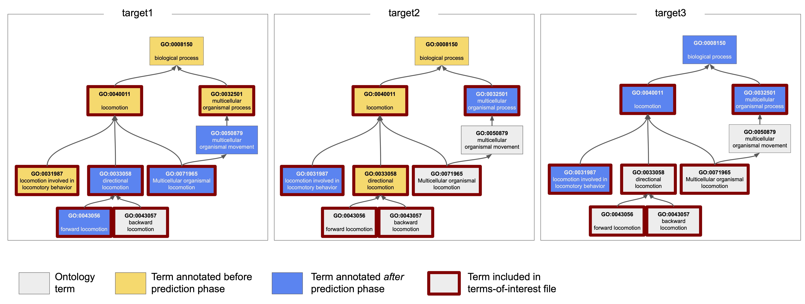

# Example Evaluation

This directory contains files for an example of partial knowledge evaluation and the use of a terms-of-interest file.

This is a "toy" example using a subgraph of the Biological Process (BP) aspect of the Gene Ontology. It is only for
illustrative purposess.



## Known annotations

Partial knowledge evaluation is used when there are existing known annotations for a target (protein) in some aspect of the 
ontology on which evaluation will be done. These known annotations must be excluded from the evaluation since 
predictions are not needed for known annotations.

To exclude known terms, a list of annotations is passed in with the `-known` input option followed by a path 
to the file containing the list. In this example, the known annotations are known with a yellow background.
The proteins target1 and target2 both have known annotations in this aspect which we will exclude from evaluation.


Known annotations file (`known_t0.tsv`): list all known annotations for all targets  
```
target1 GO:0008150
target1 GO:0040011
target1 GO:0032501
target1 GO:0031987
target2 GO:0008150
target2 GO:0040011
target2 GO:0033058
```

## Ground truth
New annotations for target1 and target2 are considered in partial knowledge evaluation since these targets 
already had knonw annotations before/during the prediction phase.

Ground truth file (`ground_truth_partial.tsv`): list new annotations on which to evaluate
```
target1 GO:0033058
target1 GO:0043056
target1 GO:0050879
target1 GO:0071965
target2 GO:0031987
target2 GO:0032501
```

Note: if any of the known annotations are listed in the ground truth file, they will be ignored during 
evaluation. 

## Terms of Interest
It is also possible to exclude some terms from evaluation for _all_ targets. The terms-of-interest file
is an optional file that is used to list all terms on which to evaluate predictions. This list is 
applied for all targets. The list of terms is passed in with the `-toi` input option. If no file is 
passed in, all terms in the graph will be used for evaluation

In this example, terms of interest are shown in figure with a red, bold outline. Note that two of the 
terms in the ontology are excluded (GO:0008150 and GO:0050879) which will not be included in any computations
for evaluation, even if they appear in the ground truth file.

Terms-of-Interest file (`toi.tsv`):
```
GO:0040011
GO:0032501
GO:0033058
GO:0031987
GO:0071965
GO:0043056
GO:0043057
``` 
